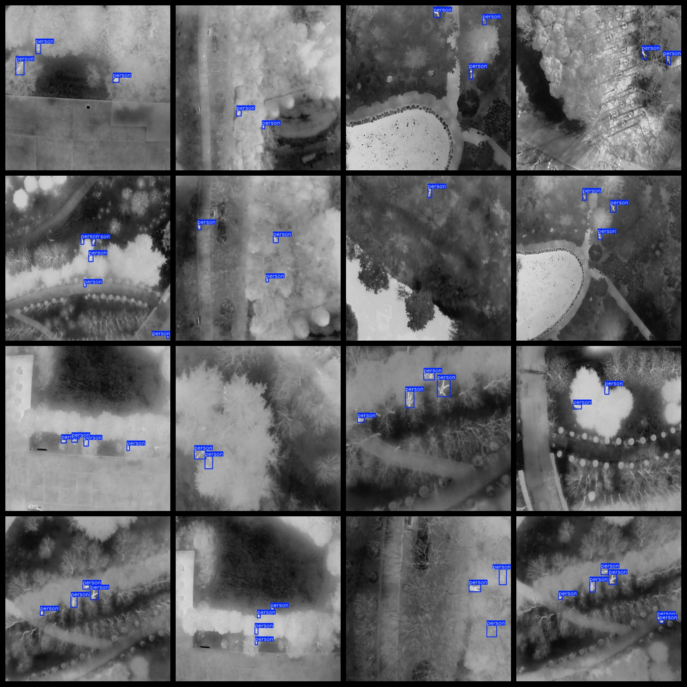

# Infrared Captured Personnel Dataset 19863 imagesVOC+YOLO format

The dataset format is Pascal VOC format + YOLO format (excluding the split path in the txt file, only including jpg images as well as the corresponding VOC format xml files and YOLO format txt files).

Number of images (jpg file count): 19863

Number of annotations (xml file count): 19863

Number of annotations (txt file count): 19863

Number of annotation categories: 1

Repository where the dataset is located: datasets_sl

Annotation category name: ["person"]

Number of bounding boxes per category:

Person bounding box count = 63656

Total bounding box count: 63656

Number of images per category:

Person has 19863 images

Image resolution: 640x640

Annotation tool used: labelImg

Dataset enhancement status: No

Annotation rule: Draw a rectangle around the category.

Important note: The dataset does not have separate training, validation, or test splits; you will need to divide it yourself.

Special notice: This dataset does not guarantee the accuracy of the trained models or weight files.

Annotation and image details are as follows:

## Images

---

Here is a pay link on Stripe (https://buy.stripe.com/3cs8yP7sY87d0vu9AB). Please contact me lonlonago@foxmail.com after funding $89, and I will send you a complete data files, thank you!

